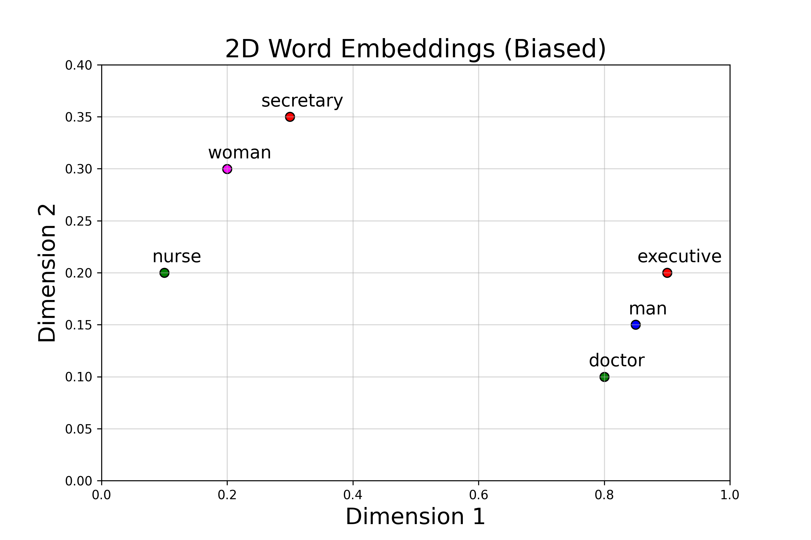
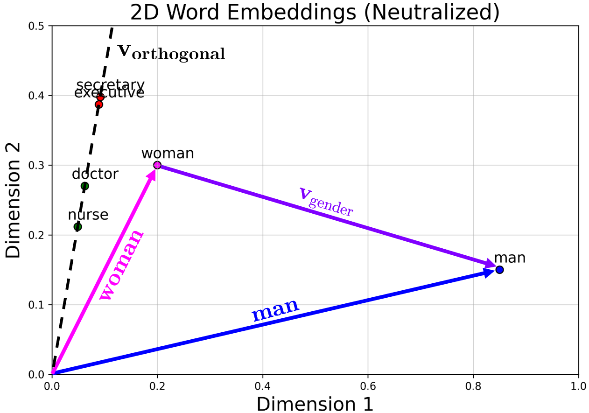
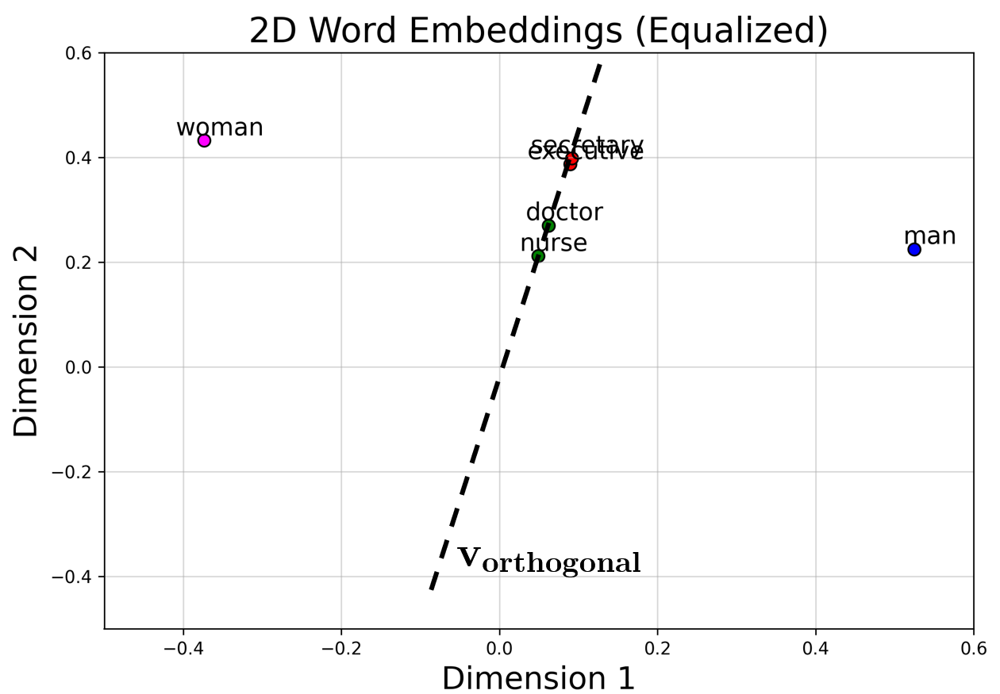

# Ethical AI: Hard Debiasing Word Embeddings From Scratch

## Overview

The **Ethical AI: Hard Debiasing Word Embeddings From Scratch** project explores the concept of debiasing word embeddings to reduce gender bias in natural language processing (NLP) models. This project focuses on implementing **hard debiasing** technique, starting from the fundamentals and building the debiasing process from scratch.

We've demonstrated the debiasing process using only one gender-word pair: 'man' and 'woman'.

## Key Features

- **Neutralization**: The method first eliminates the directional similarity or alignment between gender-neutral words and gendered words.
- **Equalization**: After neutralization, the positions of the gendered word pairs are adjusted to make them equidistant from gender-neutral words to remove the spatial similarity.

- **Visual Demonstration**: Provides a clear visual representation of how the positions of gender-neutral words and gendered word pairs change throughout the debiasing process. The steps are demonstrated clearly, showing how the bias is progressively removed.

## Results

### Word Embeddings (Biased)

### Word Embeddings (Neutralized)

### Word Embeddings (Equalized)

